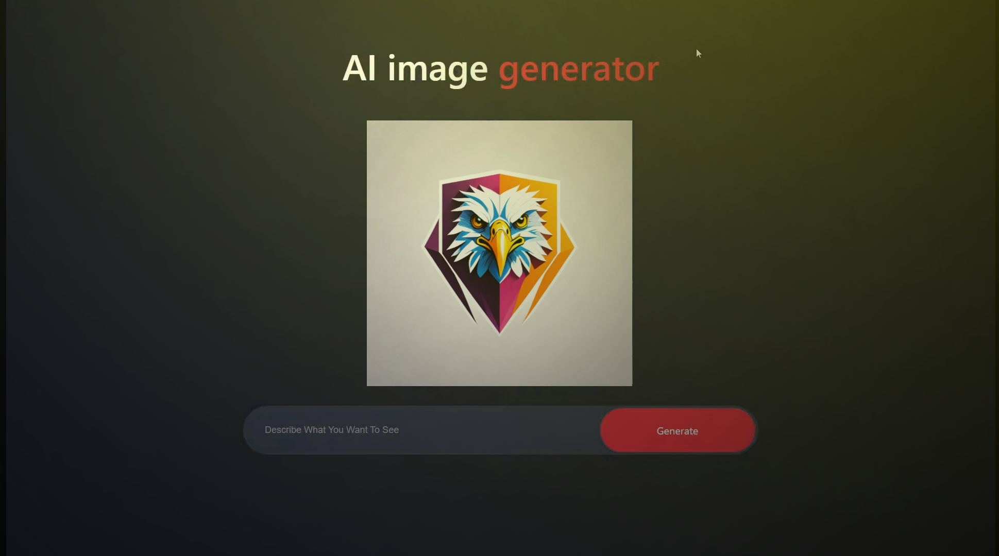

<p align="center">  
  <a href="tiktok.com/">
  <p align="center">

    

<p>
  <p align="center">
<a href="https://github.com/mrhansamala"></a>
                                                                                                                    


 


#### Fork the repo
 <p>
<p>
  <p align="center">
<a href="https://github.com/mrhansamala/Ai-Image-Generator-Website/fork"></a>


📰Please read this 📰
```js  
   
   /*
Your Open Ai Api Key Add  src/Components/Assets/ImageGenerator/ImageGenerator.jsx

GOOD BYE Have NICE DAY

DEVOLOPER BY MR_HANSAMALA
  }      
    */
   
```
<br>

- **DEVOLOPER  MR-Hansamala** 
- - **WEBSITE**
